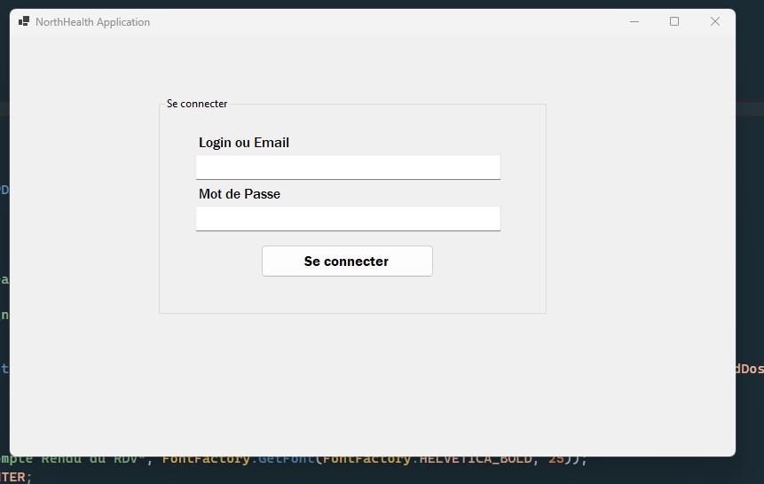
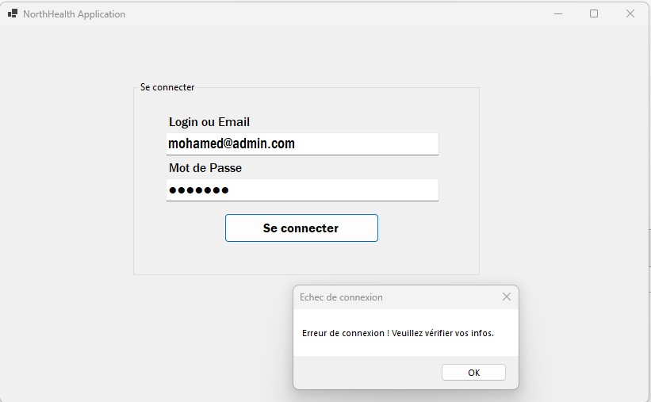
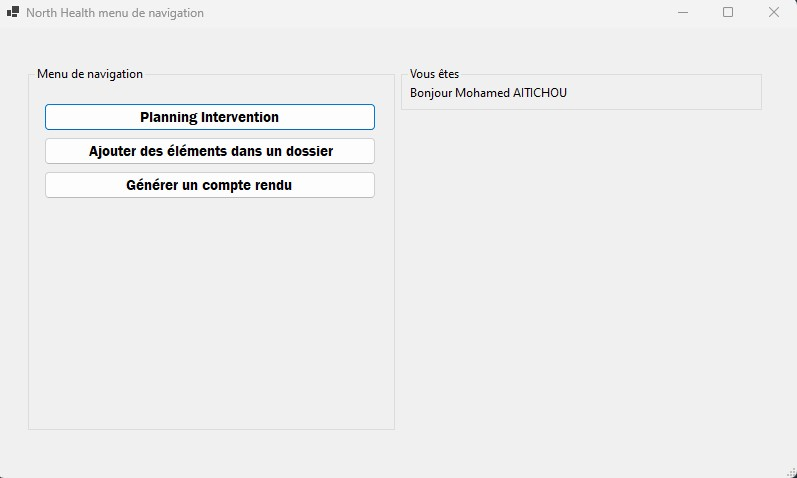
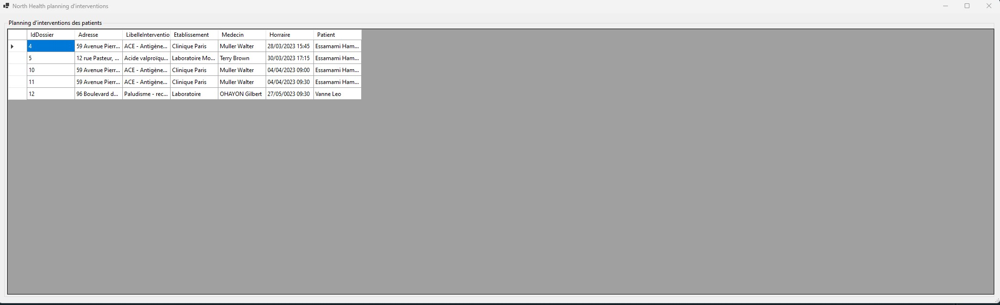
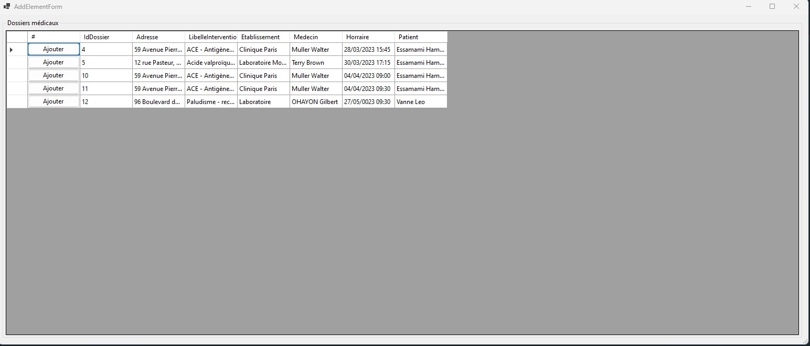
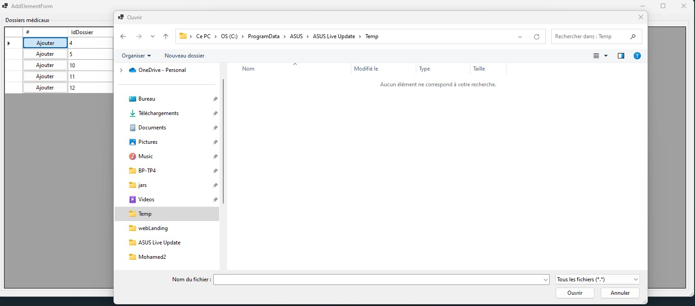
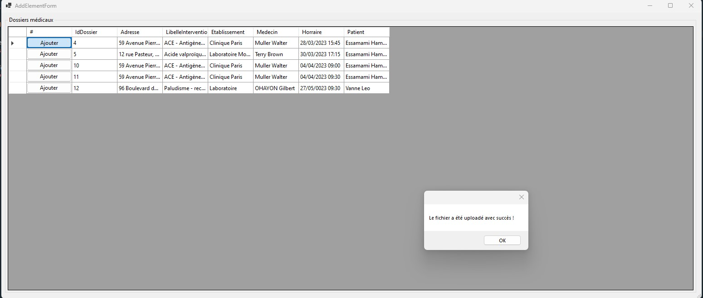
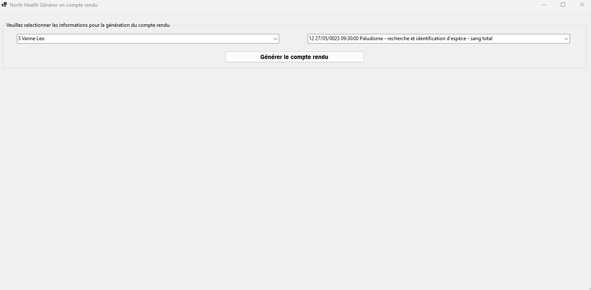
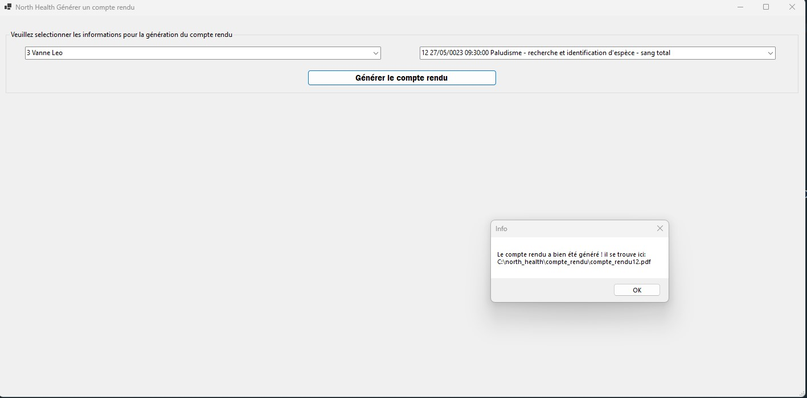
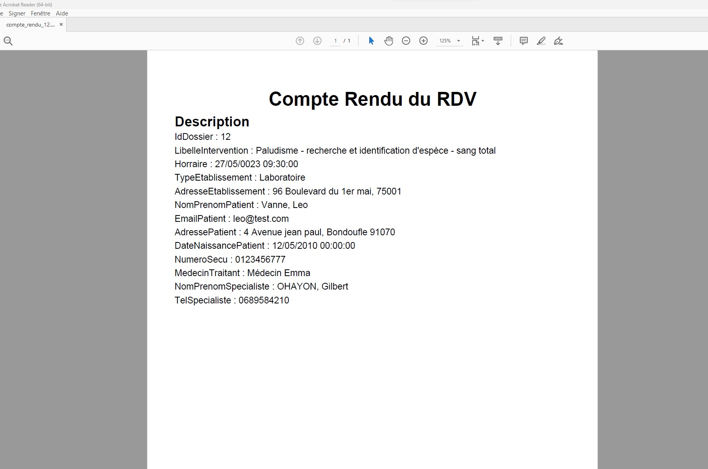

### **NORTH HEALTH Client Lourd**

`C#` `Windows Forms`

##### **Objectif**
A l’aide de vos connaissances et de vos réalisations de projet 1, développez une application lourde
permettant notamment à :
- Mission 1 : Un administratif est de se connecter et d’accéder au planning des interventions ;
- Mission 2 : Un personnel médical est capable d’ajouter des éléments (radio, scanner, rapport,
...) sur le patient ;
- Mission 3 : Un administratif est capable de générer une facture ;

> **Fenêtre de connexion**

> **Fenêtre échec de connexion**

> **Fenêtre de navigation après authentification**

> **Fenêtre de connexion**

> **Fenêtre de visualisation des plannings**

> **Fenêtre d'ajout des éléments à un dossier patient (certificat médical, ordonance, etc...)**

> **Fenêtre de notification d'ajout avec succès**

> **Fenêtre de selectionne des informations pour générer un compte rendu**

> **Fenêtre de notification compte rendu généré avec succès**

> **Consultation du fichier pdf généré**

